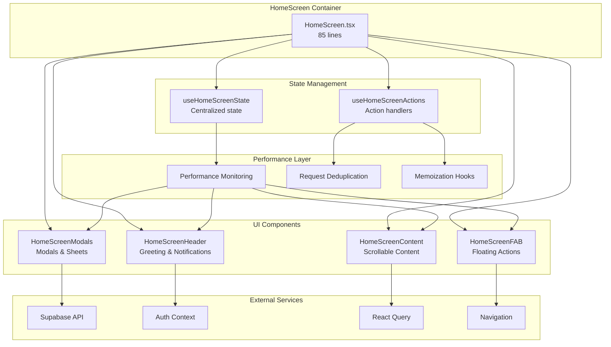
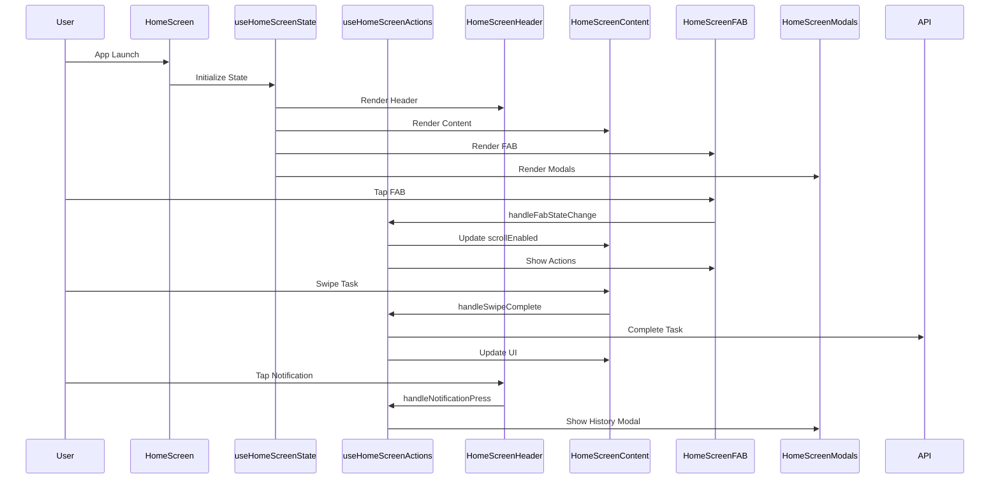
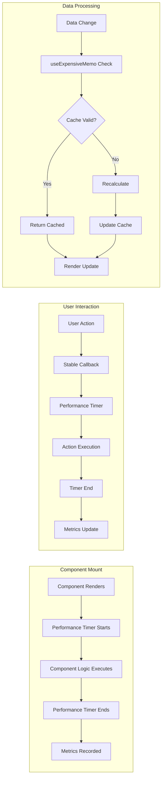
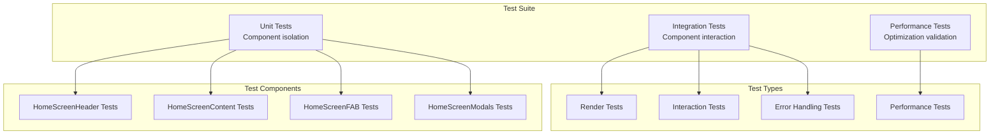
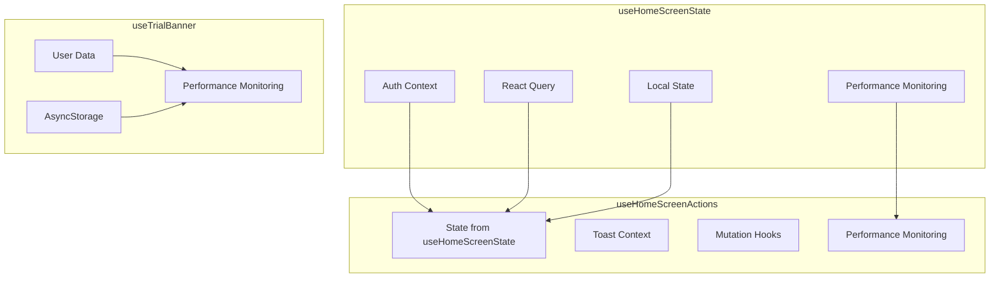
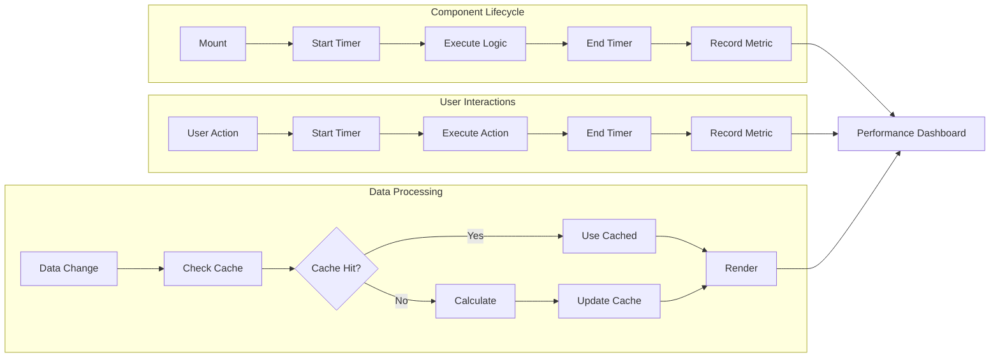
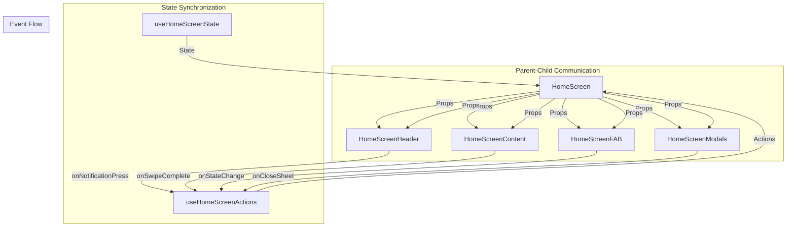

# HomeScreen Component Interaction Diagram

## 🏗️ **Component Architecture Overview**

## 🔄 **Data Flow Diagram**

## ⚡ **Performance Optimization Flow**

## 🧪 **Testing Architecture**

## 🔧 **Hook Dependencies**

## 📊 **Performance Metrics Flow**

## 🎯 **Component Communication**

## 🔍 **Error Handling Flow**

```mermaid
graph TD
    subgraph "Error Boundaries"
        A[Component Error] --> B[Error Boundary]
        B --> C[Fallback UI]
        C --> D[Error Logging]
    end

    subgraph "Network Errors"
        E[API Error] --> F[Error State]
        F --> G[Retry Mechanism]
        G --> H[User Feedback]
    end

    subgraph "Performance Errors"
        I[Slow Performance] --> J[Performance Alert]
        J --> K[Optimization Suggestion]
        K --> L[Auto-optimization]
    end
```

## 📱 **Mobile-Specific Considerations**

```mermaid
graph TB
    subgraph "Touch Interactions"
        A[Touch Start] --> B[Gesture Recognition]
        B --> C[Action Execution]
        C --> D[Visual Feedback]
    end

    subgraph "Scroll Performance"
        E[Scroll Event] --> F[Throttle Scroll]
        F --> G[Update UI]
        G --> H[Maintain 60fps]
    end

    subgraph "Memory Management"
        I[Component Unmount] --> J[Cleanup Timers]
        J --> K[Clear Caches]
        K --> L[Release Memory]
    end
```

---

## 📚 **Key Benefits of This Architecture**

1. **🔧 Maintainability**: Clear separation of concerns
2. **⚡ Performance**: Optimized with memoization and monitoring
3. **🧪 Testability**: Component-level testing capabilities
4. **📱 Scalability**: Easy to extend and modify
5. **🐛 Debugging**: Clear data flow and error boundaries
6. **📊 Monitoring**: Built-in performance tracking
